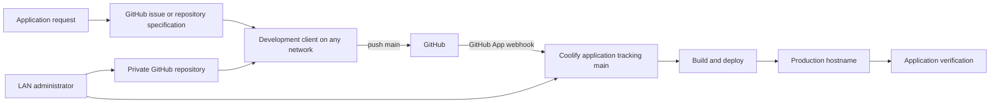

# GitHub-to-Coolify Deployment Workflow

This repository documents a conventional GitHub App deployment workflow for
building applications from any development computer while keeping the Coolify
management plane private.

## What this solves

Development clients may be outside the deployment network and may use different
editors or coding agents. Giving every client direct Coolify access creates
unnecessary credential, networking, and compatibility problems.

The adopted workflow separates one-time infrastructure provisioning from normal
development:

- a LAN-side administrator creates the repository and Coolify resource;
- application requirements are recorded in a normal GitHub issue or repository
  specification;
- a development client works through GitHub from any network; and
- Coolify deploys the tracked production branch when its GitHub App receives the
  push event.

## Deployment path

The development client needs GitHub access, not a Coolify token, Coolify CLI
context, VPN, or LAN route. Direct Coolify access remains with the administrator
for first-time resource creation and infrastructure diagnosis.

## Responsibilities

| Role | Responsibility |
|---|---|
| Administrator | Create the private repository, seed `main`, grant the existing GitHub App access, create the Coolify application, configure domains, variables and health behavior, and enable Auto Deploy |
| Development client | Clone the prepared repository, implement the linked work item, test locally, and push the completed revision to `main` |
| GitHub | Store source, enforce repository access, and deliver authenticated push events to Coolify |
| Coolify | Pull the configured branch, build the application, inject runtime variables, route the hostname, and retain deployment logs |

## Reference stack

| Layer | Reference stack |
|---|---|
| Source control | Private GitHub organization repositories |
| Work specification | GitHub issue or versioned repository documentation |
| Source integration | Coolify GitHub App installed for the required organization repositories |
| Production branch | `main` |
| Deployment | Coolify Auto Deploy from GitHub push events |
| Application runtime | Dockerfile or Docker Compose behind Coolify's proxy |
| Public ingress | DNS and an operator-managed HTTPS reverse proxy when required |
| Optional application AI | Provider-neutral server-side variables supplied by Coolify |

Live platform versions and capabilities are authoritative.

## Normal operating sequence

1. The administrator receives the application brief.
2. A private organization repository is created with an initial `main` branch.
3. The brief and acceptance criteria are recorded in a GitHub issue or repository
   specification.
4. A Coolify application is created from that repository through the existing
   GitHub App and configured to track `main` with Auto Deploy enabled.
5. The development client is given the repository URL and work-item reference.
6. The development client builds and tests the application, then pushes `main`.
7. GitHub notifies Coolify, which builds and deploys the pushed revision.
8. The production hostname and representative application behavior are verified.

No agent-to-agent bootstrap document or generated deployment prompt is required.
A coding agent may still receive a short task such as “implement issue #1 in this
repository,” but GitHub remains the source of truth for requirements and state.

## Security boundary

The remote development environment receives only repository access. Coolify
credentials, deployment-provider secrets, internal addresses, CLI configuration,
and infrastructure logs remain outside the application repository and remote
task context.

Application secrets are stored in Coolify and injected server-side at runtime.
They must not enter source code, browser bundles, build output, screenshots, or
GitHub issues.

## Documentation

- [Architecture and trust boundaries](docs/ARCHITECTURE.md)
- [Administrator provisioning](docs/PROVISIONING.md)
- [Development and deployment workflow](docs/WORKFLOW.md)
- [Production validation](docs/VALIDATION.md)
- [Setup and reproduction](docs/REPRODUCTION.md)
- [Security model](docs/SECURITY.md)
- [Lessons learned](docs/LESSONS-LEARNED.md)
- [Change history](CHANGELOG.md)

## Official references

- [Coolify: Set up a GitHub App](https://coolify.io/docs/applications/ci-cd/github/setup-app)
- [Coolify: GitHub Auto Deploy](https://coolify.io/docs/applications/ci-cd/github/auto-deploy)
- [GitHub CLI](https://cli.github.com/)
- [Coolify CLI repository](https://github.com/coollabsio/coolify-cli)

`coollabsio/coolify-cli` is the project name; the executable is `coolify`.
