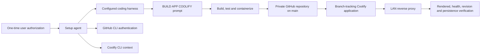
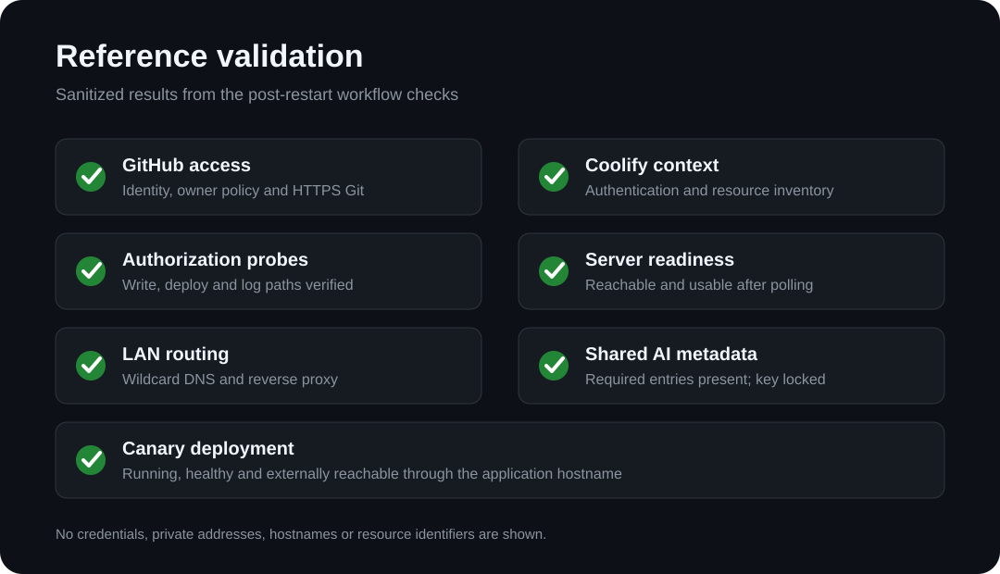

# Portable App Builder for Coolify

This portfolio project documents a harness-agnostic workflow that turns one
application request into a tested application, a private GitHub repository, and
a verified Coolify deployment.

## Problem statement

AI coding harnesses could build an application, but reliably publishing and
deploying it still required manual GitHub setup, Coolify onboarding, credential
repair, and post-deployment checking. Authentication also behaved differently
inside different harness command environments, causing workflows that passed in
an external terminal to fail as soon as a real application task started.

The goal was to make future builds prompt-only after one secure host bootstrap,
while using standard supported tools and avoiding harness-specific automation.

The intended steady-state interaction is one prompt:

```text
BUILD APP COOLIFY:

[Describe the application to build.]
```

That prompt is sufficient only **after a one-time secure bootstrap** has
configured and verified the selected coding harness, GitHub CLI, and the official
Coolify CLI. A completely fresh computer still requires the user to approve
GitHub authentication and securely supply deployment credentials once.

## Individual contribution

I designed the workflow contract and iteratively tested and hardened it against
failures observed across multiple coding harnesses. My contribution included:

- separating secure bootstrap responsibilities from unattended application work;
- defining the compatibility contract for any selected coding harness;
- standardizing publication and deployment on the official GitHub and Coolify
  CLIs;
- enforcing the required GitHub owner instead of silently using a personal
  account;
- designing idempotent branch-tracking Coolify application reuse and placement;
- correcting LAN reverse-proxy routing and duplicate-health-check failures;
- adding server-side provider-neutral AI variable handling;
- developing non-mutating authorization and post-restart environment checks; and
- defining the rendered-browser, revision, stability, and persistence completion
  gates.

## Architecture



The setup agent receives confidential bootstrap values. Future runtime tasks
receive only sanitized instructions and the application prompt.

## Hardware and software stack

| Layer | Reference stack |
|---|---|
| Operator computer | Authorized LAN workstation running a user-selected coding harness |
| Deployment host | Virtualized Linux server managed through Coolify |
| Application runtime | Dockerfile or Docker Compose application behind Coolify's reverse proxy |
| Source control | Git, private GitHub repositories, and GitHub CLI |
| Deployment control | Official `coollabsio/coolify-cli` project; `coolify` executable |
| Networking | Per-application wildcard-DNS LAN hostname with portless client access |
| Optional application AI | OpenAI-compatible provider injected server-side through Coolify shared variables |
| Reference versions | Coolify CLI 1.8.0 and Coolify server 4.3.14 |

Live detected versions and capabilities remain authoritative.

## Test method and results

The workflow was tested from the same command environment used by the target
harness after a complete restart—not merely from the setup shell.

| Test | Method | Reference result |
|---|---|---|
| GitHub identity and owner access | Separate `gh` identity, membership, policy, and HTTPS Git checks | Passed |
| Coolify authentication | Named context verification plus non-sensitive inventory queries | Passed |
| Coolify authorization | Non-mutating missing-resource probes for write, deploy, and logs | Expected HTTP 404 for all three |
| Deployment server | Start native validation, then poll server metadata | Reachable and usable |
| LAN routing prerequisite | Resolve unused wildcard hostname and request it through port 80 | Correct private address; expected unconfigured-route 404 |
| Shared AI configuration | Inspect environment-scoped variable metadata without sensitive output | Three required entries present; key locked |
| Canary application | Deploy through official CLI and check application state and `/healthz` | Running, healthy, HTTP 200 |
| Publication security | Scan public content against known credentials and path/address patterns | No known secret, private address, UUID, or workstation path published |

## Demonstration evidence

The image below is a sanitized visual summary of the live reference checks. It
omits credentials, internal addresses, hostnames, and resource identifiers.



These results validate the reference infrastructure and workflow contract. A
fresh, unrepaired application run is still required before claiming universal
one-shot reliability for a newly selected harness.

## Design boundaries

This project intentionally does not use:

- credential brokers or wrapper CLIs;
- helper deployment scripts or direct Coolify API clients;
- plugins, hooks, skills, MCP servers, or custom slash commands;
- generated GitHub Actions or webhook relays;
- fixed public host-port mappings; or
- credentials in prompts, repositories, runtime instructions, or browser code.

The private bootstrap used on the reference installation is deliberately **not
included** here because it contains deployment and model-provider credentials.
This repository explains the design and validation contract, not those secrets.

## Documentation

- [Architecture and trust boundaries](docs/ARCHITECTURE.md)
- [Bootstrap procedure](docs/BOOTSTRAP.md)
- [Application workflow](docs/WORKFLOW.md)
- [Production validation contract](docs/VALIDATION.md)
- [Setup and reproduction](docs/REPRODUCTION.md)
- [Security model](docs/SECURITY.md)
- [Problems found and lessons learned](docs/LESSONS-LEARNED.md)
- [Change history](CHANGELOG.md)

## Official components

- [GitHub CLI](https://cli.github.com/)
- [Coolify](https://coolify.io/)
- [Official Coolify CLI repository](https://github.com/coollabsio/coolify-cli)

`coollabsio/coolify-cli` is the project name. The executable is `coolify`; it is
not an npm package and is never invoked as `coollabsio`.

## Reproduce the approach

Start with [Setup and reproduction](docs/REPRODUCTION.md). Reproduction requires
your own GitHub owner, Coolify installation, official CLI contexts, and securely
managed credentials. The private reference bootstrap is intentionally excluded.
